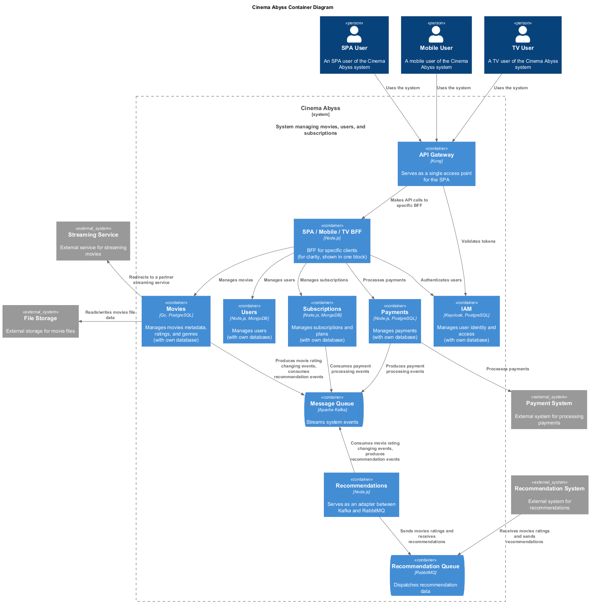
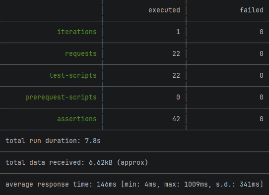
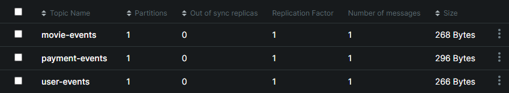
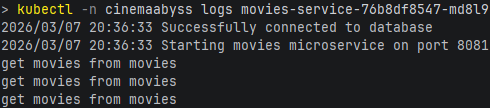
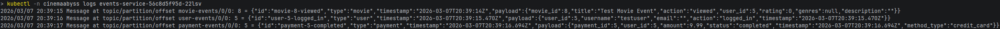
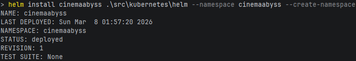
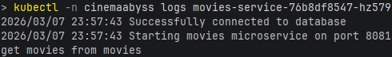
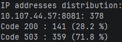

# Проектная работа

## Задание 1

## Задание 2

### 1. Proxy

[Proxy](src/microservices/proxy)

### 2. Kafka

[Events](src/microservices/events)

**Тесты:**

**Kafka topics:**

## Задание 3

### 1. CI/CD

* [Docker Build and Push](.github/workflows/docker-build-push.yml)
* [API Tests](.github/workflows/api-tests.yml)

### 2. Proxy в Kubernetes

**Movies service logs:**

**Events service logs:**

## Задание 4

**Helm deployment:**

**Movies service logs:**

# Задание 5

[Circuit breaker configuration](src/kubernetes/circuit-breaker-config.yaml)

**Circuit breaker stats:**

